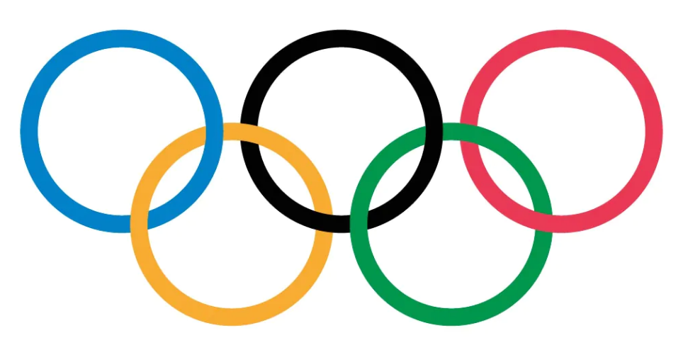

---
title: ""
output: pdf_document
---

```{r setup, include=FALSE}
knitr::opts_chunk$set(echo = TRUE)
```
# Statistical Computing - Exercises 06 - Plotting the Olympic Rings

Your task is to draw Olympic Rings using R code. You should
try to draw them as closely as possible to how they are pictured in the
image below.

Some Notes that may help:

1. It's more complicated than it looks at first sight.

2. Break the problem into repeatable tasks, and write a function.

3. Look into the polygon function.

4. Do the best you can. You may need to approximate some aspects.




